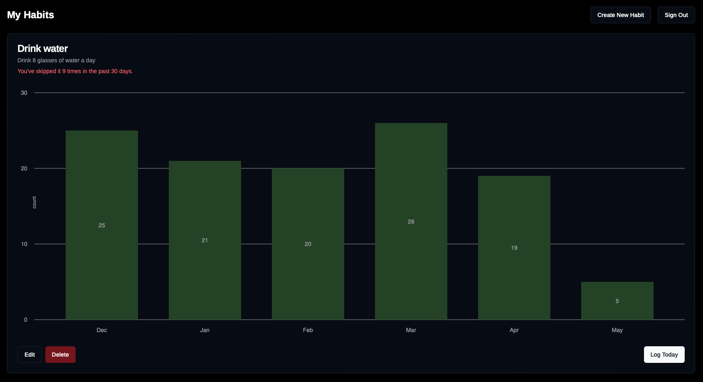

# Habit Tracker

You can view the app on https://habit.selcukcihan.com

* This app was created using [v0.dev](https://v0.dev).
* It uses nextjs and dynamodb.
* It's hosted on vercel.

## Preview



## Environment Variables

You need to set the following env variables:

```.env
AUTH_SECRET={YOUR_SECRET_KEY_THAT_YOU_GENERATED}
AUTH_GOOGLE_ID={YOUR_GOOGLE_ID}.apps.googleusercontent.com
AUTH_GOOGLE_SECRET={YOUR_GOOGLE_SECRET}
AUTH_DYNAMODB_ID={YOUR_AWS_ACCESS_KEY_ID}
AWS_ACCESS_KEY_ID={YOUR_AWS_ACCESS_KEY_ID}
AUTH_DYNAMODB_SECRET={YOUR_AWS_SECRET_ACCESS_KEY}
AWS_SECRET_ACCESS_KEY={YOUR_AWS_SECRET_ACCESS_KEY}
AWS_DEFAULT_REGION={YOUR_DYNAMODB_TABLE_REGION}
AWS_REGION={YOUR_DYNAMODB_TABLE_REGION}
AUTH_DYNAMODB_REGION={YOUR_DYNAMODB_TABLE_REGION}
DYNAMODB_TABLE_NAME={YOUR_DYNAMODB_TABLE_NAME}
```

To run the app locally, you can put your env variables in `.env.local`

## DynamoDB

On AWS console I've created
* a dynamodb table: stores user, session & habit data.
* an IAM user with a managed policy attached to it that grants dynamodb access

You can inspect the cloudformation template I've generated from my cloud resources: [aws_cloudformation_template.yaml](aws_cloudformation_template.yaml)

## Getting Started

This is a [Next.js](https://nextjs.org/) project bootstrapped with [`create-next-app`](https://github.com/vercel/next.js/tree/canary/packages/create-next-app).

First, run the development server:

```bash
npm run dev
# or
yarn dev
# or
pnpm dev
# or
bun dev
```

Open [http://localhost:3000](http://localhost:3000) with your browser to see the result.

You can start editing the page by modifying `app/page.tsx`. The page auto-updates as you edit the file.

This project uses [`next/font`](https://nextjs.org/docs/basic-features/font-optimization) to automatically optimize and load Inter, a custom Google Font.

## Learn More

To learn more about Next.js, take a look at the following resources:

- [Next.js Documentation](https://nextjs.org/docs) - learn about Next.js features and API.
- [Learn Next.js](https://nextjs.org/learn) - an interactive Next.js tutorial.

You can check out [the Next.js GitHub repository](https://github.com/vercel/next.js/) - your feedback and contributions are welcome!

## Deploy on Vercel

The easiest way to deploy your Next.js app is to use the [Vercel Platform](https://vercel.com/new?utm_medium=default-template&filter=next.js&utm_source=create-next-app&utm_campaign=create-next-app-readme) from the creators of Next.js.

Check out our [Next.js deployment documentation](https://nextjs.org/docs/deployment) for more details.
